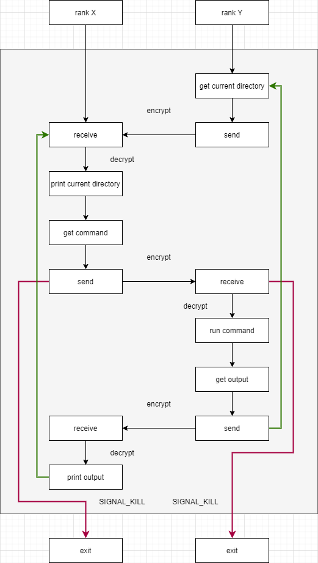
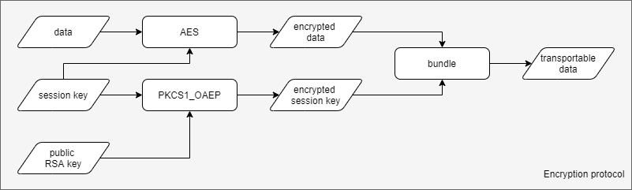
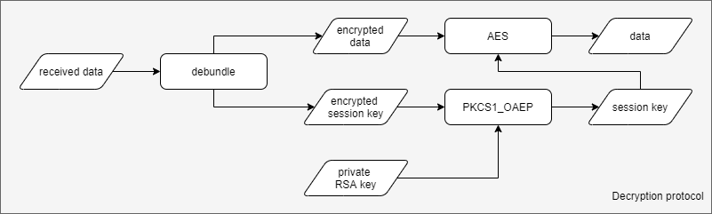

# Dove-shell

A [pigeon-shell](https://github.com/dinhanhx/pigeon-shell) using MPI instead of socket

```
                                           ...   
                                           .` o `._ 
                                           :    .--'     
                                           ;   ( 
                                   ,,,,..,'     \
                .---------,:-"---"`<<<<<<<:      ;
                 `----lc.. `-._<<`",._,.'`       | 
                          `""-.`""- -'          ; 
                               '"..           ,/
                             ~"^"~^''-..,m_m-'`~"^"~"^
                                   ~"^"~"^"~"^~
```

## Introduction

Dove-shell is like [ssh](https://www.ssh.com/) but is not reactive and is one-to-one. In justification of this, one client connects to one server and one server only listens to one client. Moreover, you **can not** run command like `cd` or `bash` etc.

This project is for educational purpose that is to understand how ssh works, how to implement asymmetric encryption, how to implement remote shell over MPI.

## Installation

For UNIX and GNU/LINUX users, you need mpi package. In case of Ubuntu, simply run `sudo apt install mpi`

For Windows users, you need MSMPI.

Python 3 setup `pip3 install -r req.txt`

## Usage

### `dove_key_gen.py`

Example:
```bash
python3 dove_key_gen.py --save_dir=rank0
python3 dove_key_gen.py --save_dir=rank1
```

This will create 2 folders. Each folders will have a pair of private and public keys.

### `dove_shell.py`

Example:
```bash
mpirun -np 2 python3 dove_shell.py --config_file=config.json
```

About `config.json`

```json
{
    "client_private_key" : "rank0/private.dove.txt",
    "server_public_key" : "rank1/public.dove.txt",
    "server_private_key" : "rank1/private.dove.txt",
    "client_public_key" : "rank0/public.dove.txt",
    "log_file" : "logs.txt"
}
```

## Protocols

### Dove-shell client-server protocol



### Security protocol



Encryption protocol



Decryption protocol
